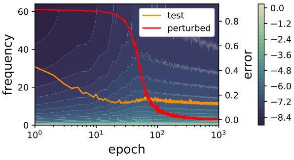

# Rethink the Connections among Generalization, Memorization and Spectral Bias

This repository is the official implementation of **Rethink the Connections among Generalization, Memorization and Spectral Bias** [https://arxiv.org/abs/2004.13954](https://arxiv.org/abs/2004.13954).


## Requirements

pytorch >= 1.1.0
tensorboardX

## Training

To train the model in the paper, run this command:

```train
python train.py data_name data_root model_name
# data_name: 'svhn', 'cifar10', 'cifar100'
# model_name: 'vgg11', 'vgg13', 'vgg16', 'resnet18', 'resnet34'
```

## Plot Spetrums

To plot spectrums, run:

```eval
python log_to_csv.py data_name model_name
python plot_energy.py data_name model_name
```

## Results

Spectrums of ResNet18 on CIFAR10:




## Contributing
If you'd like to contribute, or have any suggestions for these guidelines, you can contact us at xiao_zhang@hust.edu.cn or open an issue on this GitHub repository.

All contributions welcome! All content in this repository is licensed under the MIT license.